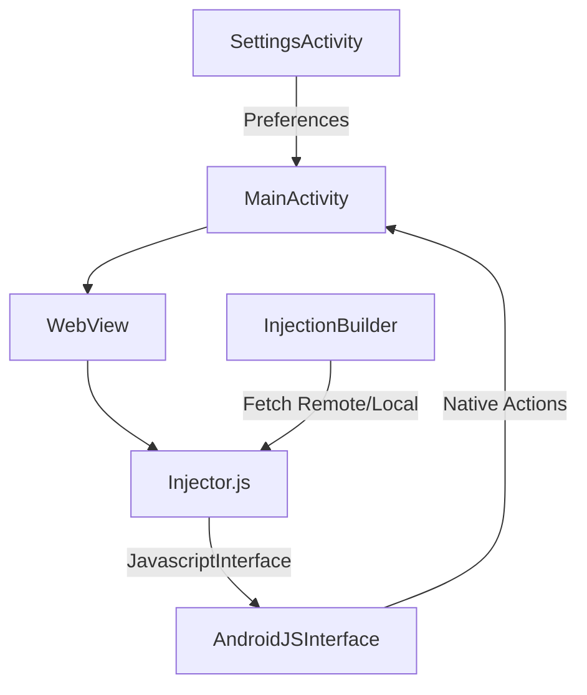

[🏠 Index](./README.md) | [Next ➡](./02-setup.md)

# Project Overview

NoReel is an Android application designed to provide a customized, distraction-free browsing experience for specific web platforms. By leveraging the Android `WebView` component, the application intercepts web traffic and injects custom JavaScript to modify the DOM, remove unwanted UI elements (such as Reels, Stories, and promotional banners), and bridge web-based events to native Android functionality.

## Key Features and Capabilities

*   **Dynamic JavaScript Injection:** Utilizes `InjectionBuilder.kt` to fetch and inject `Injector.js` into the `WebView` context, allowing for real-time UI modifications without requiring application updates.
*   **Native-Web Bridge:** Implements `AndroidJSInterface.kt` to expose native Android methods to the web environment, enabling features like opening external browsers, reloading the page, and toggling UI elements.
*   **Remote Update Mechanism:** Supports fetching updated injection scripts from remote repositories, ensuring the UI filtering logic remains current.
*   **Custom WebView Clients:** Extends `WebViewClient` (`WebViewViewport.kt`) and `WebChromeClient` (`ChromeViewport.kt`) to handle page navigation, error states, and console logging for debugging.
*   **Settings Management:** Provides a native settings interface via `SettingsActivity.kt` and `PreferenceFragmentCompat` to manage user preferences.

## Technology Stack

| Category | Technology |
| :--- | :--- |
| **Languages** | Kotlin, JavaScript |
| **UI Framework** | Jetpack Compose, Android View System (XML) |
| **Core Frameworks** | Android SDK, AndroidX Preferences, AndroidX Webkit |
| **Build System** | Gradle |
| **Networking** | `java.net.HttpURLConnection` |

## High-Level Architecture

The application architecture centers on the `MainActivity`, which hosts the `WebView`. The `InjectionBuilder` manages the lifecycle of the JavaScript injection, while the `AndroidJSInterface` acts as the communication bridge between the web content and the native Android environment.



## Key Components

The following table outlines the primary classes responsible for the core functionality of NoReel:

| Class Name | Responsibility |
| :--- | :--- |
| `MainActivity.kt` | Entry point; manages `WebView` lifecycle and `SharedPreferences`. |
| `InjectionBuilder.kt` | Handles fetching and loading `Injector.js` from local assets or remote URLs. |
| `UpdateChecker.kt` | Monitors remote repositories for application updates and notifies the user. |
| `AndroidJSInterface.kt` | Exposes native methods (e.g., `openInStdBrowser`, `reloadPage`) to the JavaScript context. |
| `SettingsActivity.kt` | Manages user-defined preferences via `PreferenceFragmentCompat`. |
| `WebViewViewport.kt` | Manages `WebViewClient` events, including error handling and page navigation. |
| `ChromeViewport.kt` | Manages `WebChromeClient` events, including console logging and permission requests. |

## Implementation Example: JavaScript Bridge

The `AndroidJSInterface` class allows the injected JavaScript to trigger native Android actions. Below is an example of how the interface is structured to handle browser redirection:

```kotlin
// app/src/main/java/com/example/noreel/AndroidJSInterface.kt

@JavascriptInterface
fun openInStdBrowser(url: String){
    if(!AlreadyUsedURLs.contains(url)){
        AlreadyUsedURLs += url
        val browserIntent = Intent(Intent.ACTION_VIEW, Uri.parse(url))
        mContext.startActivity(browserIntent)
        Log.d("StdBrowserRequest", url)
    }
}
```

## Documentation Quick Links

*   **[README](README.md)**: Project introduction and setup instructions.
*   **[Changelog](CHANGELOG.md)**: Version history and release notes.

[🏠 Index](./README.md) | [Next ➡](./02-setup.md)