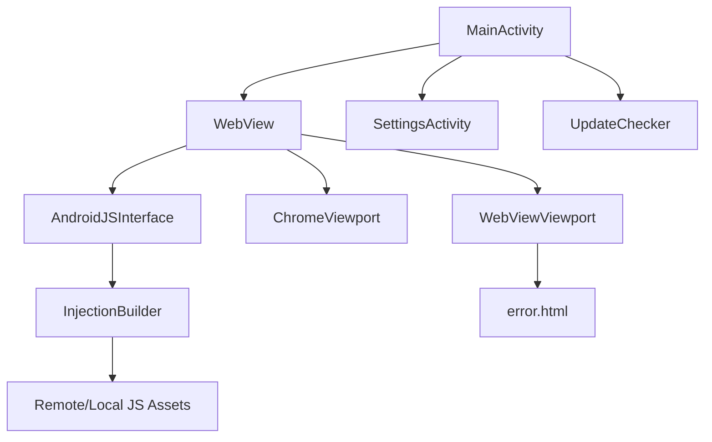

[⬅ Previous](./01-overview.md) | [🏠 Index](./README.md) | [Next ➡](./03-deployment.md)

# NoReel Local Development Setup

This guide provides instructions for setting up the NoReel Android project on a local development machine.

## Prerequisites

Ensure your development environment meets the following requirements before attempting to build the project.

| Requirement | Version | Purpose |
| :--- | :--- | :--- |
| **JDK** | 17 (Temurin/Zulu) | Required for Gradle build execution |
| **Android Studio** | Latest Stable | IDE for development and debugging |
| **Android SDK** | API 34+ | Target platform and build tools |
| **Git** | Latest | Version control |

## Clone and Install

1. **Clone the repository:**
   ```bash
   git clone https://github.com/Kalbra/NoReel.git
   cd NoReel
   ```

2. **Verify Gradle Wrapper:**
   The project includes a Gradle wrapper. Use the wrapper to ensure consistent build behavior across environments.
   ```bash
   chmod +x gradlew
   ./gradlew --version
   ```

3. **Sync Project:**
   Open the `NoReel` directory in Android Studio. The IDE will automatically detect the `build.gradle` file and initiate a Gradle sync. If the sync does not start automatically, navigate to **File > Sync Project with Gradle Files**.

## Environment Configuration

The project does not use a `.env` file. Instead, environment-specific configurations and secrets for release builds are managed via `gradle.properties`.

### Signing Configuration
To build release artifacts locally, ensure your `~/.gradle/gradle.properties` file contains the following keys, or pass them as command-line arguments:

* `SIGNING_KEY` (Base64 encoded keystore)
* `ALIAS`
* `KEY_STORE_PASSWORD`
* `KEY_PASSWORD`

## Project Architecture

The following diagram illustrates the interaction between the core components of the NoReel application:



### Key Components
* **SettingsActivity**: Manages user preferences using `PreferenceFragmentCompat`. It handles the UI for application settings.
* **UpdateChecker**: Responsible for checking remote versions of the application by fetching the `build.gradle` file from the repository to ensure the user is running the latest version.

## Running the Project

### Using Android Studio
1. Connect an Android device or start an Emulator (API 34 recommended).
2. Select the `app` module in the run configuration dropdown.
3. Click the **Run** button (green play icon).

### Using Command Line
To build and install the debug APK on a connected device:
```bash
./gradlew installDebug
```

To build the APK without installing:
```bash
./gradlew assembleDebug
```

## Running Tests

The project includes both local unit tests and instrumented tests.

### Local Unit Tests
These tests run on the development machine JVM.
```bash
./gradlew test
```
*Example location:* `app/src/test/java/com/example/noreel/ExampleUnitTest.kt`

### Instrumented Tests
These tests require an Android device or emulator.
```bash
./gradlew connectedAndroidTest
```
*Example location:* `app/src/androidTest/java/com/example/noreel/ExampleInstrumentedTest.kt`

## Troubleshooting

### WebView Errors
If the application fails to load content or displays `error.html`, check the `WebViewViewport.kt` implementation. The application specifically handles `errorCode == -2` (often related to slow internet or DNS issues on API 34).
* **Fix:** Ensure your emulator or device has an active internet connection. Check the Logcat for `WebInternal` tags to debug specific loading failures.

### InjectionBuilder Failures
The `InjectionBuilder.kt` class fetches JavaScript injections from a remote GitHub repository.
* **Issue:** If the app fails to inject scripts, the remote URL `https://raw.githubusercontent.com/Kalbra/NoReel/master/app/src/main/assets/Injector.js` may be unreachable.
* **Fix:** Verify network connectivity. If you are modifying the injection logic, ensure you are testing against the local `assets/Injector.js` file by toggling the `fetchLocal` method in `InjectionBuilder.kt`.

### Gradle Sync Issues
If the project fails to sync due to missing SDK components:
1. Open **Tools > SDK Manager** in Android Studio.
2. Ensure your Android SDK is up to date. Local builds typically resolve build tools automatically via the Android Gradle Plugin.
3. Clean the project:
   ```bash
   ./gradlew clean

[⬅ Previous](./01-overview.md) | [🏠 Index](./README.md) | [Next ➡](./03-deployment.md)