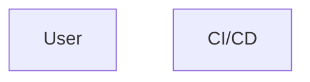

[⬅ Previous](./01-overview.md) | [🏠 Index](./README.md) | [Next ➡](./03-setup.md)

# Project Structure

This document describes the directory tree, module organization, and module dependencies of the NoReel Android application.

## Directory Tree

The following tree represents the layout of the repository:

```
NoReel/
├── .github/
│   └── workflows/
│       ├── android.yml       # CI build pipeline
│       └── release.yml       # Release/signing pipeline
├── app/
│   ├── src/
│   │   ├── androidTest/      # Instrumented Android tests
│   │   ├── main/
│   │   │   ├── assets/
│   │   │   │   ├── error.html      # Local fallback error page for WebView
│   │   │   │   └── Injector.js     # JS script injected into WebView to filter DOM
│   │   │   ├── java/com/example/noreel/
│   │   │   │   ├── MainActivity.kt        # Application main entry point
│   │   │   │   ├── SettingsActivity.kt    # Settings interface
│   │   │   │   ├── UpdateChecker.kt       # Remote version checking logic
│   │   │   │   ├── AndroidJSInterface.kt  # Native-Web Javascript bridge
│   │   │   │   ├── InjectionBuilder.kt    # Logic for managing JS injection
│   │   │   │   ├── WebViewViewport.kt     # Custom WebViewClient implementation
│   │   │   │   └── ChromeViewport.kt      # Custom WebChromeClient implementation
│   │   │   └── res/                # XML layouts, values, and drawable assets
│   │   └── test/                   # Local JVM unit tests
│   ├── build.gradle                # Module build configurations
│   └── proguard-rules.pro          # ProGuard obfuscation configuration
├── gradle/                         # Gradle Wrapper distribution files
├── build.gradle                    # Project-level Gradle build file
├── gradle.properties               # Gradle build property configurations
├── settings.gradle                 # Multi-project gradle configuration
└── README.md                       # Core repository introduction
```

## Module Organization

The project is structured as a single-module Android application:

*   **`app` Module:** Contains the entire codebase, including UI components, WebView configurations, assets, and Gradle build instructions.
*   **Assets (`app/src/main/assets`):** Contains static assets, including `Injector.js` (DOM-filtering logic) and `error.html` (the fallback page).
*   **Source Code (`app/src/main/java`):** Hosts the main activity, settings activity, custom viewports (WebView clients), and the JS-to-native interface bridge.

## Module Dependencies

No inter-module dependencies were detected since the project is a unified Android application package.

### Architecture Overview



[⬅ Previous](./01-overview.md) | [🏠 Index](./README.md) | [Next ➡](./03-setup.md)