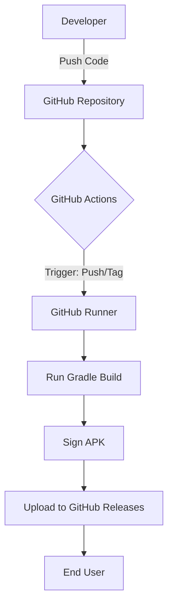

[⬅ Previous](./02-setup.md) | [🏠 Index](./README.md) | [Next ➡](./04-js-bridge-architecture.md)

# Deployment & CI/CD

This document outlines the deployment architecture, build environment, CI/CD pipeline, and operational procedures for the NoReel Android application.

## Deployment Architecture

The NoReel deployment architecture relies on GitHub Actions for automated build, signing, and distribution. The application is distributed primarily via GitHub Releases.

## Build Environment

To ensure consistent build results, the project utilizes the Gradle Wrapper (`gradlew`). This ensures that all CI runners and local development environments use the exact same Gradle version, independent of the host system's installed software.

The build environment is configured to use JDK 17, as defined in the GitHub Actions workflow files located in `.github/workflows/`.

## CI/CD Pipeline

The CI/CD pipeline is defined in `.github/workflows/`. It automates testing, building, and signing.

### Pipeline Stages

| Stage | Workflow File | Trigger | Action |
| :--- | :--- | :--- | :--- |
| **CI Build** | `android.yml` | Push/PR to `master` | Runs `./gradlew build` to verify compilation and tests. |
| **Release Build** | `release.yml` | Tag `v*` | Builds `assembleRelease`, signs with secrets, and uploads to GitHub Releases. |

### Signing Configuration
The `release.yml` workflow utilizes the `r0adkll/sign-android-release@v1` action. The following secrets must be configured in the GitHub repository settings:

*   `SIGNING_KEY`: Base64 encoded keystore file.
*   `ALIAS`: Key alias name.
*   `KEY_STORE_PASSWORD`: Password for the keystore.
*   `KEY_PASSWORD`: Password for the specific key.

## Environment Configuration

The application manages environment-specific configurations using Gradle `buildTypes`.

| Environment | Build Type | Purpose |
| :--- | :--- | :--- |
| **Development** | `debug` | Local testing, includes `debuggable` flag, uses local `Injector.js`. |
| **Production** | `release` | Final distribution, R8/ProGuard enabled, optimized assets. |

Configuration is managed within `app/build.gradle`. Ensure that `debug` builds are not distributed to end-users to prevent security vulnerabilities related to the `ApplicationInfo.FLAG_DEBUGGABLE` check found in `InjectionBuilder.kt`.

Additionally, the `SettingsActivity.kt` component provides the user interface for managing application preferences. It utilizes `PreferenceFragmentCompat` to load settings from `res/xml/preferences.xml`, allowing users to configure app behavior without requiring a recompile.

## Monitoring and Logging

### Local Logging
The application uses the Android `Log` class for internal diagnostics. These logs are accessible via Logcat in Android Studio.

*   **Tag:** `WebInternal`
    *   Used in `WebViewViewport.kt` for page errors.
    *   Used in `AndroidJSInterface.kt` for JavaScript bridge communication.
    *   Used in `ChromeViewport.kt` for console message forwarding.
*   **Tag:** `InjectionBuilder`
    *   Used in `InjectionBuilder.kt` to track remote script fetching status.

### Production Monitoring
For production environments, it is recommended to integrate **Firebase Crashlytics**. This allows for:
1.  **Crash Reporting:** Automatic capture of unhandled exceptions.
2.  **Non-fatal Logging:** Tracking of `Log.e` calls, such as the network errors captured in `InjectionBuilder.kt`.

## Remote Update Mechanism

The application includes an `UpdateChecker` component located in `UpdateChecker.kt`. This service monitors the remote repository for version changes. It fetches the `build.gradle` file from the `master` branch to compare versions and notify the user of available updates. This ensures that users are running the latest version of the application without needing to check the repository manually.

## Rollback Procedures

### GitHub Releases Rollback
If a release is identified as faulty:
1.  **Revert Code:** Revert the commit in the `master` branch that introduced the issue.
2.  **Tagging:** Create a new tag (e.g., `v1.0.1`) based on the last known stable commit.
3.  **Trigger:** Push the new tag to trigger the `release.yml` workflow, which will generate a new, stable APK. The release notes will be automatically generated using the `CHANGELOG.md` file.

---

### Why included

**Reason:** Architecture 'monolith' recommends this section

**Confidence:** 90%

[⬅ Previous](./02-setup.md) | [🏠 Index](./README.md) | [Next ➡](./04-js-bridge-architecture.md)