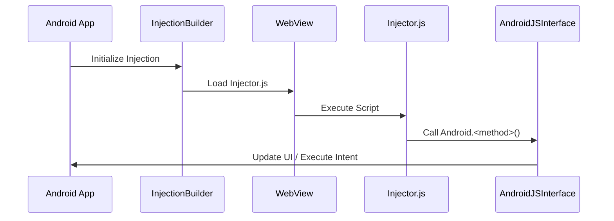

[⬅ Previous](./04-deployment.md) | [🏠 Index](./README.md) | [Next ➡](./06-webview-management.md)

# JavaScript Bridge Architecture

The NoReel application utilizes a bridge architecture to facilitate bidirectional communication between the embedded `WebView` (rendering web content) and the native Android application layer. This allows the application to manipulate the DOM of the loaded web page and trigger native Android functionality, such as launching external browsers or updating UI components.

## Architecture Overview

The architecture consists of three primary components: the `InjectionBuilder` (delivery), the `Injector.js` (client-side logic), and the `AndroidJSInterface` (native bridge).



## Component Definitions

### 1. AndroidJSInterface
Located at `app/src/main/java/com/example/noreel/AndroidJSInterface.kt`, this class acts as the native bridge. It exposes specific methods to the JavaScript context, allowing the web content to interact with the Android framework.

All methods annotated with `@JavascriptInterface` are accessible from the `WebView` via the `Android` object.

| Method | Description | Threading |
| :--- | :--- | :--- |
| `log(msg: String)` | Logs messages to Logcat under the "WebInternal" tag. | Background |
| `setSettingsMenuButton()` | Makes the preference button visible on the UI. | Main Thread |
| `deleteSettingsMenuButton()` | Hides the preference button from the UI. | Main Thread |
| `openInStdBrowser(url: String)` | Launches an external browser intent for the provided URL. | Main Thread |
| `reloadPage()` | Triggers the `updateViewport` Runnable to refresh the WebView. | Main Thread |

**Implementation Note:** Because `WebView` executes JavaScript on a background thread, all UI-related operations (e.g., `preference_button.visibility`) are wrapped in a `Handler(Looper.getMainLooper())` to ensure thread safety.

### 2. Injector.js
Located at `app/src/main/assets/Injector.js`, this script is injected into the `WebView` context. It performs DOM manipulation to remove unwanted elements (banners, reels, story strips) and monitors navigation.

The script interacts with the bridge using the global `Android` object:

```javascript
// Example: Calling the bridge from Injector.js
if (settings_icon){
    Android.setSettingsMenuButton();
} else {
    Android.deleteSettingsMenuButton();
}
```

### 3. InjectionBuilder
Located at `app/src/main/java/com/example/noreel/InjectionBuilder.kt`, this utility manages the lifecycle of the injection script. It supports two modes of operation:

*   **Remote Fetching (`fetchRemote`):** Opt-in only. Downloads the pinned `Injector.js` URL from GitHub and accepts it only when the SHA-256 hash matches the bundled script.
*   **Local Loading (`fetchLocal`):** Loads the `Injector.js` file bundled within the `app/src/main/assets/` directory.

## Integration Lifecycle

To enable the bridge, the `WebView` must be configured to allow JavaScript execution and the interface must be registered.

### Registration Example
In the Activity or Fragment hosting the `WebView`, register the interface as follows:

```kotlin
val webView: WebView = findViewById(R.id.webview)
val preferenceButton: Button = findViewById(R.id.pref_button)

// Define the update logic
val updateViewport = Runnable { webView.reload() }

// Register the bridge with a thread-safe URL provider callback
webView.addJavascriptInterface(
    AndroidJSInterface(
        preferenceButton,
        this,
        updateViewport,
        { currentUrl } // Thread-safe cached URL provider
    ), 
    "Android"
)

// Enable JavaScript
webView.settings.javaScriptEnabled = true
```

## Troubleshooting

### Threading Violations
If the application crashes when calling a bridge method, verify that the `AndroidJSInterface` method is using the `mainHandler` to post UI updates. Direct manipulation of `View` objects from the `JavascriptInterface` thread will throw a `CalledFromWrongThreadException`.

### Injection Failures
If `Injector.js` fails to execute:
1.  **Verify `javaScriptEnabled`:** Ensure `webView.settings.javaScriptEnabled = true` is set before loading the URL.
2.  **Check `InjectionBuilder` state:** If using `fetchRemote`, ensure the device has network connectivity. If the fetch fails, the application should fall back to `fetchLocal` to ensure basic functionality.
3.  **Debug Mode:** When `ApplicationInfo.FLAG_DEBUGGABLE` is active, the `InjectionBuilder` may alter its fetching behavior. Check the `InjectionBuilder.getCode` implementation to verify which source is being prioritized during development.

---

### Why included

**Reason:** The project relies heavily on a custom bridge between native Android and web content. Developers need to understand how this interface is exposed, how scripts are injected, and how data is passed back and forth to maintain security and stability.

**Confidence:** 75%


**Evidence:**

- `AndroidJSInterface.kt`: AndroidJSInterface.kt

- `Injector.js`: Injector.js

- `InjectionBuilder.kt`: InjectionBuilder.kt

[⬅ Previous](./04-deployment.md) | [🏠 Index](./README.md) | [Next ➡](./06-webview-management.md)