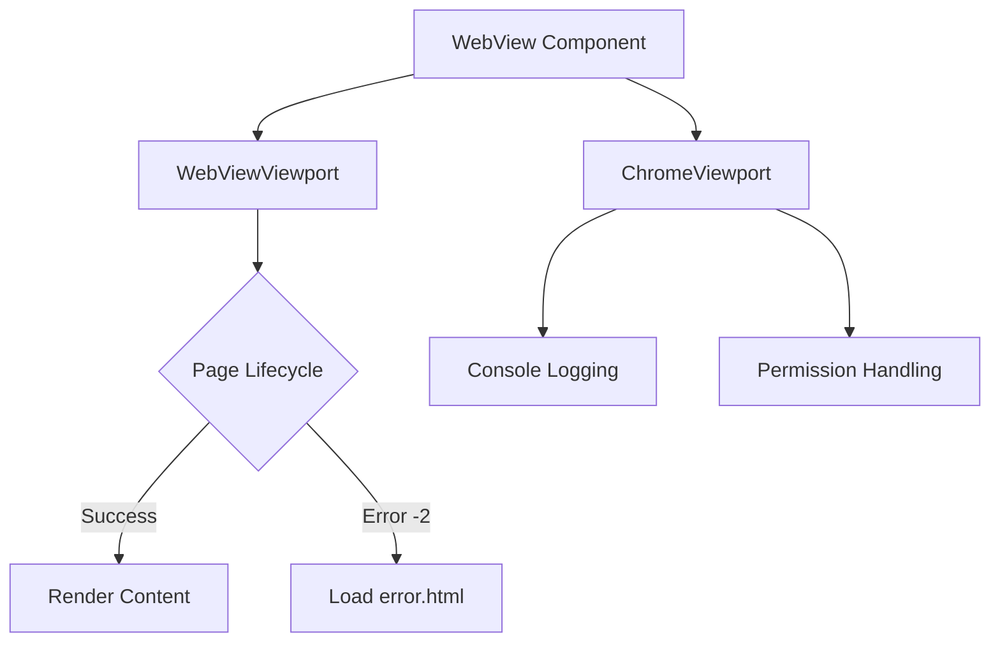

[⬅ Previous](./04-js-bridge-architecture.md) | [🏠 Index](./README.md)

# WebView and Viewport Management

The NoReel application utilizes a custom WebView architecture to handle web content rendering, error management, and browser-level interactions. This system is split into two primary components: `WebViewViewport` for handling navigation and resource loading, and `ChromeViewport` for managing browser-level features such as console logging and permission requests.

## Architecture Overview

The architecture separates the concerns of page lifecycle management from browser UI capabilities. By extending `WebViewClient` and `WebChromeClient`, the application gains granular control over how web content is displayed and how the Android system interacts with the web environment.



## WebViewViewport

The `WebViewViewport` class, located in `app/src/main/java/com/example/noreel/WebViewViewport.kt`, extends `WebViewClient`. It is responsible for intercepting page navigation events and handling network-related errors.

### Class Definition

```kotlin
class WebViewViewport(private val context: Context, private val onUrlChanged: (String?) -> Unit = {}) : WebViewClient()
```

### Key Methods

| Method | Purpose |
| :--- | :--- |
| `onPageFinished` | Triggered when a page load completes. Currently reserved for future JavaScript injection logic. |
| `onReceivedError` | Intercepts network errors. Specifically handles error code `-2` (often associated with connectivity issues) by redirecting to a local error asset. |

### Error Handling Implementation

The `onReceivedError` method provides a fallback mechanism for network failures. When a `WebResourceError` with code `-2` is detected, the WebView redirects to the local `error.html` file located in the assets directory.

```kotlin
override fun onReceivedError(
    view: WebView?,
    request: WebResourceRequest?,
    error: WebResourceError?
) {
    if (error!!.errorCode == -2) {
        Log.e("WebInternal", error.description.toString() + error.errorCode)
        view?.loadUrl("file:///android_asset/error.html")
    } else {
        super.onReceivedError(view, request, error)
    }
}
```

## ChromeViewport

The `ChromeViewport` class, located in `app/src/main/java/com/example/noreel/ChromeViewport.kt`, extends `WebChromeClient`. It manages browser-level UI interactions, debugging, and system permissions.

### Class Definition

```kotlin
class ChromeViewport : WebChromeClient()
```

### Key Methods

| Method | Purpose |
| :--- | :--- |
| `onConsoleMessage` | Intercepts JavaScript console logs and redirects them to the Android Logcat system under the tag `WebInternal`. |
| `onPermissionRequest` | Filters WebView permission requests by trusted origin and allowed resource before granting. |

### Debugging and Permissions

The implementation only enables WebView debugging for debug builds and denies WebView permission requests unless both the requesting origin and resource are explicitly allowed.

```kotlin
override fun onConsoleMessage(consoleMessage: ConsoleMessage): Boolean {
    Log.d(
        "WebInternal",
        "${consoleMessage.message()} -- Line: ${consoleMessage.lineNumber()} of ${consoleMessage.sourceId()}"
    )
    return true
}

override fun onPermissionRequest(request: PermissionRequest?) {
    val allowedResources = WebViewSecurityPolicy.allowedPermissionResources(
        request?.origin?.toString(),
        request?.resources
    )

    if (allowedResources.isEmpty()) {
        request?.deny()
        return
    }

    request?.grant(allowedResources)
}
```

## Configuration and Integration

To integrate these components into the main application layout, they must be attached to the `WebView` instance during initialization.

### Implementation Example

```kotlin
val webView = findViewById<WebView>(R.id.webView)

// Configure WebView settings
webView.settings.javaScriptEnabled = true

// Attach custom Viewports
webView.webViewClient = WebViewViewport(context) { url ->
    // Handle URL changed events
}
webView.webChromeClient = ChromeViewport()

// Load initial URL
webView.loadUrl("https://example.com")
```

## Troubleshooting

### Network Error -2
If the application frequently triggers the `error.html` page, verify the following:
1. **Connectivity:** Ensure the device has an active internet connection.
2. **Manifest Permissions:** Confirm that `android.permission.INTERNET` is declared in `AndroidManifest.xml`.
3. **Asset Existence:** Verify that `app/src/main/assets/error.html` exists and is correctly formatted.

### Console Logging
If logs are not appearing in Logcat:
1. Filter by the tag `WebInternal`.
2. Ensure the `ChromeViewport` is correctly instantiated and assigned to the `WebView` instance.
3. Verify that the JavaScript code in the web content is actually executing `console.log()` statements.

---

### Why included

**Reason:** The app contains specialized logic for handling web viewports which deviates from standard Android UI components. Documenting this is essential for anyone modifying the rendering behavior or troubleshooting display issues.

**Confidence:** 75%


**Evidence:**

- `WebViewViewport.kt`: WebViewViewport.kt

- `ChromeViewport.kt`: ChromeViewport.kt

[⬅ Previous](./04-js-bridge-architecture.md) | [🏠 Index](./README.md)
